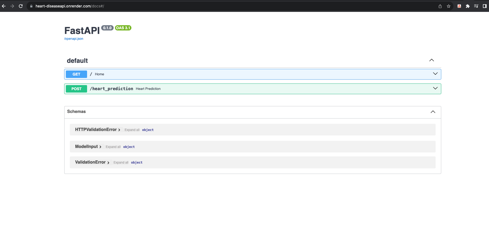

# **Heart Disease Prediction API with FastAPI**

This project deploys a machine learning model that predicts if a patient has a heart disease or not as an API using FastAPI. The model is built using logistic regression and trained on a dataset obtained from [Kaggle](https://www.kaggle.com/datasets/cherngs/heart-disease-cleveland-uci?select=heart_cleveland_upload.csv). The purpose of this project is to demonstrate how to deploy a machine learning model as a web API using FastAPI, enabling users to make predictions by sending HTTP requests to the deployed endpoints.

# Contents

* [**Features**](<#features>)
* [**Technologies Used**](<#technologies-used>)
* [**Deployment**](<#deployment>)
    * [**Cloning and Setting up**](<#cloning-and-setting-up>)
* [**Contribution**](<#contribution>)
* [**Additional Information**](<#additional-information>)

# Features

The API has two endpoints.
1. The first endpoint [https://heart-diseaseapi.onrender.com/] which is the home enpoint, using the **GET** method returns a JSON object containing a welcome message.


2. The second endpoint [https://heart-diseaseapi.onrender.com/heart_prediction] is responsible for making predictions; Here, using the **POST** method, the client sends the patients data to the API and it returns a JSON object containing a message predicitng if the patient has heart disease or not.


Below is the list of features and their correspopnding datatype sent as the request body to the endpoint. For more information on the features, see [Kaggle](https://www.kaggle.com/datasets/cherngs/heart-disease-cleveland-uci?select=heart_cleveland_upload.csv)

```
age : int
sex : int
cp :int
trestbps : int
chol : int
fbs : int
restecg : int
thalach : int
exang : int
oldpeak : float
slope : int
ca : int
thal : int
```
3. The API [documentation](https://heart-diseaseapi.onrender.com/docs#/) The documentation  provides a detailed explanation of the request body and response.



[Back to top](<#contents>)

# Technologies Used
* Python 
* [FastAPI](https://fastapi.tiangolo.com/)
* [render](https://render.com/) - used to deploy the API.
* [Postman](https://www.postman.com/) - Used as a client to interact with the API.

[Back to top](<#contents>)

# Deployment

### **To deploy the API**
The API is deployed on render. Follow these [instructions](https://docs.render.com/deploy-fastapi) to learn how to deploy **FastAPI** app on [render](https://render.com/)

Here is the  link to the deployed FastAPI app on Render: https://heart-diseaseapi.onrender.com/

### **Cloning and Setting up**
1. Clone this repository to your local mmachine
``` 
https://github.com/precious-ijege/Heart_diseaseAPI.git 
```
2. Navigate to the project directory
```
cd Heart_diseaseAPI
```
3. Install the required python packages
```
pip install -r requirements.txt
```
4. Start the server using uvicorn
```
uvicorn main:app --reload
```
The application will be running on `http://localhost:8000`. Open your browser or any other client application to access the home page endpoint

6. Use the provided endpoints to interact with the model:

    Home Endpoint: `GET /`: Provides information about the API.

    Prediction Endpoint: `POST /heart_prediction`: Make predictions for new patient data. Send a JSON payload with patient data to receive predictions.

[Back to top](<#contents>)

# Contribution
Contributions to this project are welcome! If you'd like to contribute, please follow these steps:

1. Fork the repository.
2. Create a new branch (git checkout -b feature-name).
3. Make your changes and commit them (git commit -am 'Add new feature').
4. Push your changes to your forked repository (git push origin feature-name).
5. Create a new pull request.

[Back to top](<#contents>)

# Additional Information
For more information about this project or for support, please contact precious.ijege@gmail.com.

[Back to top](<#contents>)

Precious Ijege 2024.
